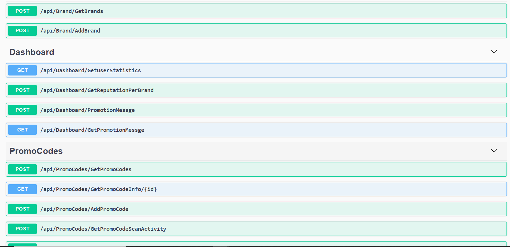

# dotnetcore-entityframework-webapi
Building REST APIs using ASP.NET Core and Entity Framework Core

Hello! 👋 This repository contains an API project written in C# and ASP.NET Core 3.0.  Project uses Entity framework (code first) and CQRS design pattern (Command Query Responsibility Segregation). 
This project helps you generate QR codes using SkiaSharp.QRCode library. Each QR code can be assigned some points. You can track which user has scanned QR Code. A dashboard which shows how many points were scanned.

## Frameworks - Packages - Patterns - Features used

  * ASP.NET Core

  * Entity Framework Core

  * Entity Framework Migrations - Code First

  * CQRS pattern

  * Automapper

  * Global exception handler

  * Cors

## Installation Instructions (1)
* Install [.NET Core](https://dotnet.microsoft.com/download)

## Installation Instructions (2) - Visual Studio
1.	Open the solution in VS 2019
2.	Modify the connection string in appsettings.json to reflect your database environment
3.	run the following commands
  *	**Add-Migration Initial**
  *	**Update-Database**
4.	Build and run the Autobot.API.Site project

## Versions
https://localhost:44396/swagger/index.html 

 
## License
Code released under the MIT license.
